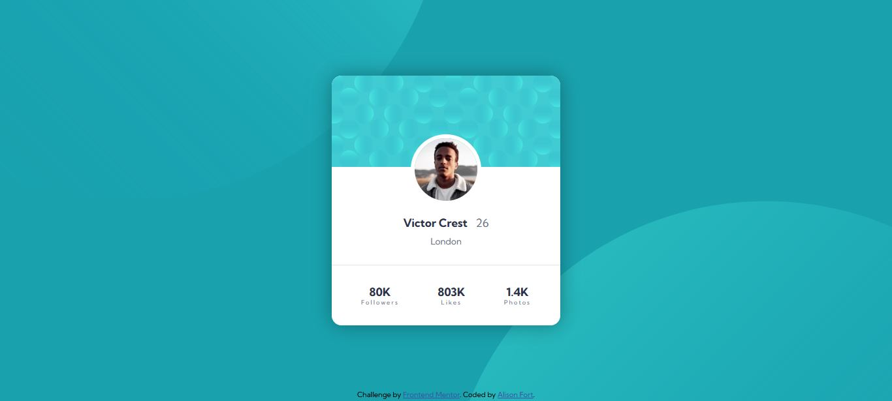

# Frontend Mentor - Profile card component solution

This is a solution to the [Profile card component challenge on Frontend Mentor](https://www.frontendmentor.io/challenges/profile-card-component-cfArpWshJ). Frontend Mentor challenges help you improve your coding skills by building realistic projects.

## Table of contents

- [Overview](#overview)
  - [The challenge](#the-challenge)
  - [Screenshot](#screenshot)
  - [Links](#links)
  - [Built with](#built-with)
  - [What I learned](#what-i-learned)
  - [Continued development](#continued-development)
  - [Useful resources](#useful-resources)
- [Author](#author)
- [Acknowledgments](#acknowledgments)

**Note: Delete this note and update the table of contents based on what sections you keep.**

## Overview

### The challenge

- Build out the project to the designs provided

### Screenshot

### Links

- Solution URL: (https://your-solution-url.com)
- Live Site URL: (https://your-live-site-url.com)

### Built with

- Semantic HTML5 markup
- CSS custom properties
- Flexbox
- Visual Studio Code

### What I learned

This project helped me learn more about CSS background properties. I also practiced using rems instead of pixels as much as I could.

### Continued development

I still need more practice with CSS background properties.

### Useful resources

- [CSS em and rem explained #CSS #responsive](https://www.youtube.com/watch?v=_-aDOAMmDHI&t=247s) - Kevin Powell's YouTube channel always helps me understand CSS concepts easily. This video explaining ems and rems was great.
- [Are you using the right CSS units?](https://www.youtube.com/watch?v=N5wpD9Ov_To) - Another video by Kevin Powell that helped me with CSS units, especially ch.

## Author

- Frontend Mentor - [@alisonfort](https://www.frontendmentor.io/profile/alisonfort)
- GitHub - [@alisonfort](https://github.com/alisonfort)

## Acknowledgments

I needed a lot of help with the background images. Kelly CHI's solution code was extremely helpful.

[Kelly's solution](https://www.frontendmentor.io/solutions/responsive-profile-card-component-using-css-flexbox-Md7rHmqW-T)
